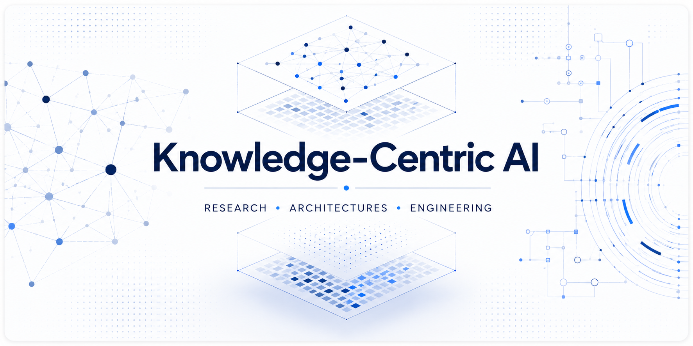

  

# Knowledge-Centric AI

**Knowledge-Centric AI** is an open collection of research papers, white papers, field guides and engineering resources exploring architectures where **knowledge**, **evidence** and **runtime capabilities** become first-class building blocks of intelligent systems.

The repository brings together scientific publications, conceptual frameworks and practical engineering references covering **Knowledge Architecture**, **Evidence-Centric AI**, **Retrieval-Augmented Generation (RAG)** and **Agent Runtime Architecture**.

---

# Research Papers

Scientific publications introducing new concepts, architectures and research directions.

| Resource                                                                                                                      | Description                                                                                                                                   |
|-------------------------------------------------------------------------------------------------------------------------------|-----------------------------------------------------------------------------------------------------------------------------------------------|
| 📄 [Knowledge-Centric Information Systems](papers/knowledge-centric-information-systems/)                                     | Introduces **Knowledge Architecture** and **Knowledge-Centric Information Systems** as an architectural discipline for operational knowledge. |
| 📄 [Governed Evolution of Agent Runtimes through Executable Operational Cognition](papers/governed-evolution-agent-runtimes/) | Proposes a governance model for the controlled evolution of agent runtimes through Executable Operational Cognition.                          |
| 📄 [From Task-Guided Conversational Graphs to Goal-Oriented Dialogue Runtimes](papers/goal-oriented-dialogue-runtimes/)       | Introduces the **Goal-Oriented Dialogue Runtime (GODR)** design pattern for long-lived conversational objectives.                             |
| 📄 [Institutional Capability Lineages (ICLA)](papers/institutional-capability-lineages) | Proposes a **registry-centered reference architecture** that transforms distributed organizational knowledge into **governed institutional capabilities** through canonical contracts, contextual assemblies, evidence-governed evolution, and persistent capability lineages. |

---

# White Papers

Conceptual frameworks connecting research with engineering practice.

| Resource | Description |
|----------|-------------|
| 📄 [From Uncertainty to Confidence](whitepapers/from-uncertainty-to-confidence/) | An evidence-centric interpretation of modern Retrieval-Augmented Generation architectures. |

---

# Field Guides

Practical engineering references for designing, evaluating and operating production AI systems.

| Resource | Description |
|----------|-------------|
| 📘 [RAG Field Guide](field-guides/rag/) | Practical handbook for designing, evaluating and operating Retrieval-Augmented Generation systems. |

---

# Research Areas

The repository currently explores four complementary research areas:

- Knowledge Architecture
- Evidence-Centric AI
- Retrieval-Augmented Generation (RAG)
- Agent Runtime Architecture

Together, these areas explore how knowledge evolves from static information into executable capabilities that can be governed, retrieved, validated and operationalized across intelligent systems.

---

# Philosophy

Rather than treating knowledge as passive information, **Knowledge-Centric AI** explores architectures where knowledge becomes an operational asset for humans, AI models, agents and software systems.

The common objective across these resources is to understand how intelligent systems transform uncertainty into trustworthy decisions through structured knowledge and evidence.

> **Confidence is not assumed. It is constructed from evidence.**

---

# Citation

If you use these resources in academic or industrial work, please cite the corresponding publication or artifact.

Repository citation metadata is provided through **CITATION.cff**. Individual publications also include their own citation files where applicable.

---

# License

Unless otherwise specified, the contents of this repository are licensed under the **Creative Commons Attribution 4.0 International (CC BY 4.0)**.

See the **LICENSE** file for details.
