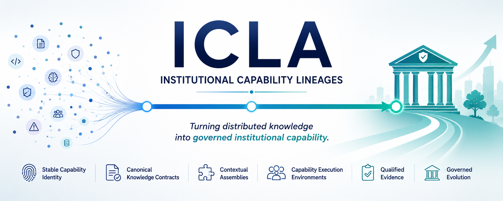
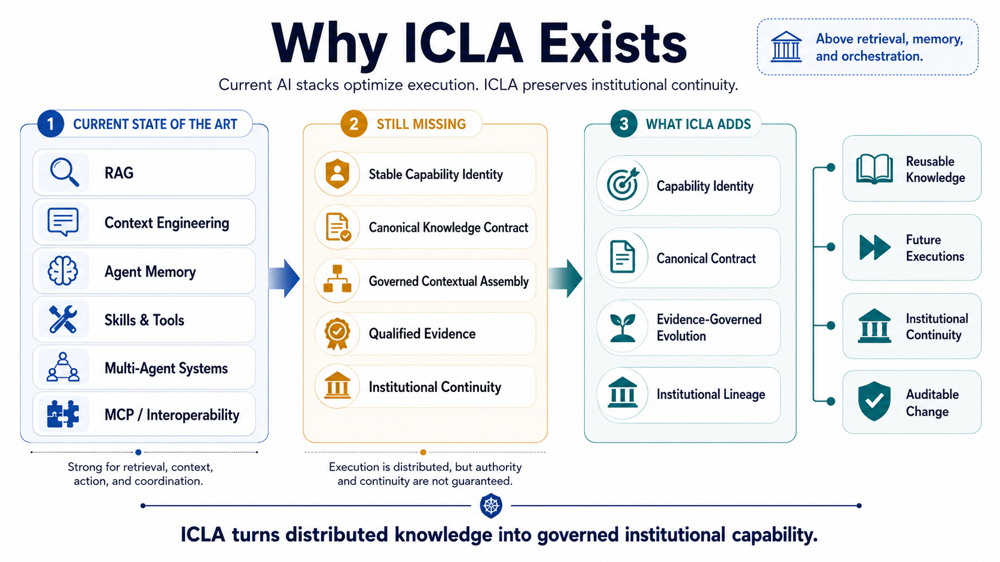
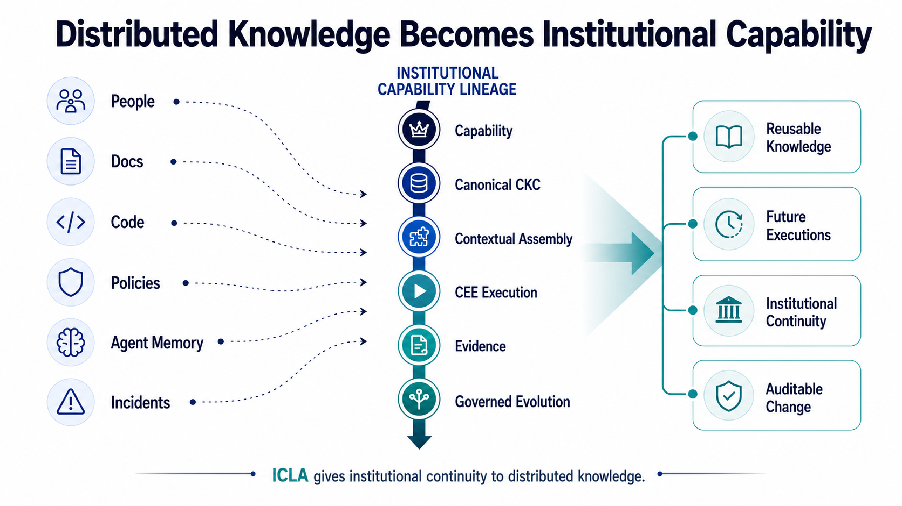
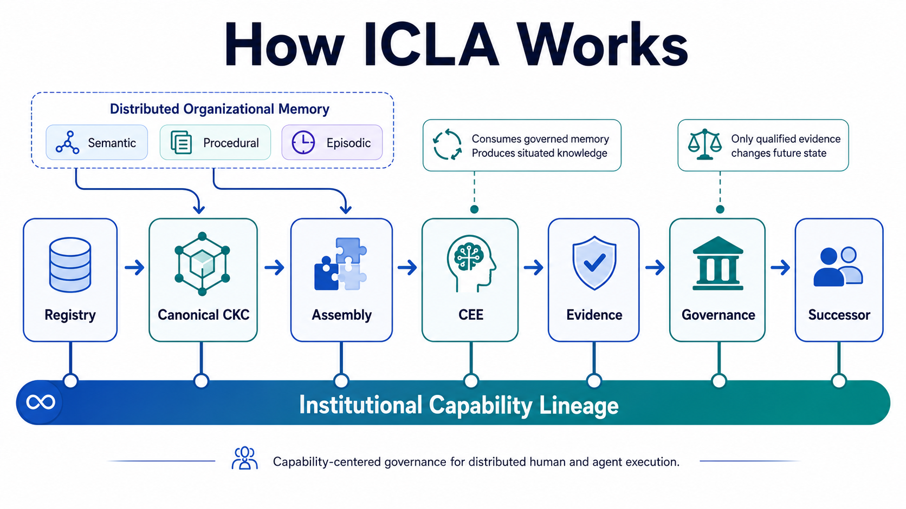

<p align="center">
  
</p>

# Institutional Capability Lineages (ICLA)

**A Registry-Centered Reference Architecture for Governed and Evolving AI**

**Author**

Mariano Garralda-Barrio

Institutional Capability Lineages (**ICLA**) is a reference architecture for preserving the continuity of recurring institutional capabilities across changing people, agents, models, workflows, systems, and infrastructures.

ICLA addresses a problem that sits above retrieval, memory, context engineering, and agent orchestration:

> **How can an institution keep a capability authoritative, executable, traceable, and evolvable when knowledge and execution are distributed?**

The architecture separates **distributed execution and knowledge production** from **institutional authority**. Humans, AI agents, workflows, software systems, and hybrid environments may reason and act locally, while capability identity, canonical contracts, evidence admission, and institutional evolution remain governed, traceable, and auditable.

The paper defines the conceptual model, architectural boundaries, lifecycle, conformance invariants, reference artifacts, worked trace, and comparative evaluation protocol.

**Quick links:** [Paper](paper.pdf) · [Citation](citation.bib) · [Schemas](specification/schemas/) · [Reference objects](specification/reference-objects/) · [Reference traces](specification/reference-traces/) · [Reference implementation](reference-implementation/)

---

## Why ICLA Exists

Current AI stacks are increasingly effective at retrieval, context construction, memory, tool use, coordination, and execution. These mechanisms improve what a system can do at runtime, but they do not by themselves guarantee:

- stable institutional capability identity;
- a canonical and versioned knowledge contract;
- governed derivation of execution-specific context;
- qualified evidence linked to the execution that produced it;
- continuity across changing people, models, agents, workflows, and systems.

ICLA introduces an institutional architecture layer that connects these responsibilities without replacing the execution technologies beneath it.



*Figure 1 — Why: the current execution stack, the institutional gap, and the architectural responsibilities introduced by ICLA.*

---

## Core Thesis

ICLA makes the **institutional capability lineage** the primary architectural unit of continuity.

A lineage connects:

- a stable institutional capability identity;
- active and historical Capability Knowledge Contracts;
- intent resolutions and contextual assemblies;
- Capability Execution Environments;
- execution evidence and measurements;
- governance decisions;
- successor activation and lifecycle changes.

Neither a Registry nor a Capability Knowledge Contract preserves this continuity in isolation. The lineage connects what must persist with what must adapt.



*Figure 2 — What: distributed organizational knowledge becomes reusable institutional capability through a governed lineage.*

### ICLA at a Glance

| Architectural question | ICLA answer |
|---|---|
| **What persists across changing execution mechanisms?** | Institutional capability identity and its lineage. |
| **What is authoritative?** | The active, versioned Capability Knowledge Contract. |
| **What is execution-specific?** | The contextual assembly and local CEE state. |
| **Who may execute?** | Humans, agents, workflows, services, or hybrid environments. |
| **What may change future institutional state?** | Qualified evidence admitted through governance. |
| **How does the architecture evolve?** | Through explicit successor activation or capability crystallization. |

---

## Architecture Overview

The main architectural flow is:

1. **Registry** — resolves stable institutional capability identity, ownership, lifecycle, relations, and the active CKC.
2. **Canonical CKC** — defines the authoritative, versioned, consumer-independent knowledge and evaluation contract.
3. **Contextual Assembly** — projects active CKCs and governed sources into an immutable execution-specific view.
4. **CEE** — executes the admitted capability instance using governed memory, local judgment, tools, and intermediate state.
5. **Evidence** — preserves outputs, measurements, provenance, assembly identity, and applicable contracts.
6. **Governance** — qualifies and adjudicates candidate institutional knowledge.
7. **Successor** — activates a new CKC version for future resolutions while preserving historical state.

The **Institutional Capability Lineage** spans the complete lifecycle rather than appearing as a final repository or isolated audit trail.



*Figure 3 — How: governed organizational memory is projected into execution, returned as evidence, and evolved through an auditable lineage.*

---

## Architectural Positioning

ICLA does not replace RAG, agent memory, context engineering, skills, multi-agent orchestration, or interoperability protocols.

Those mechanisms primarily operate at execution time:

- **RAG** retrieves information for a request.
- **Context engineering** constructs execution context.
- **Agent memory** supports local continuity.
- **Skills and tools** provide executable actions.
- **Agent runtimes** reason, act, and coordinate.
- **MCP and other protocols** provide interoperability.
- **ICLA** governs which institutional capability is responsible, which contract is authoritative, how execution views are derived, and how evidence may legitimately change future institutional state.

ICLA therefore operates at the institutional architecture layer around heterogeneous human and machine execution.

---

## Key Architectural Objects

### Organizational Memory

ICLA treats organizational memory as versioned knowledge distributed across documents, code, policies, decisions, data, approved interpretations, observations, and evidence.

Its contents may play overlapping functional roles:

- **semantic** — concepts, policies, models, and approved interpretations;
- **procedural** — methods, controls, workflows, and executable practices;
- **episodic** — prior executions, decisions, exceptions, incidents, and evidence.

These roles describe how governed knowledge functions for a capability. They are not storage layers, and one source may support several roles. Source owners retain content authority while CKCs govern bindings and projection into capability execution.

### Institutional Capability

A recurring, outcome-oriented institutional responsibility with:

- a stable identity;
- accountable ownership;
- lifecycle state;
- typed relations;
- an active Capability Knowledge Contract.

### Institutional Capability Registry

A navigable institutional address book that manages:

- capability identity;
- ownership and lifecycle;
- typed capability relations;
- risk, policy, and applicability metadata;
- pointers to active CKC versions;
- lineage and impact paths.

The Registry indexes distributed knowledge through governed bindings rather than duplicating source content.

### Capability Knowledge Contract

A **Capability Knowledge Contract (CKC)** is the canonical, versioned, consumer-independent contract for the knowledge and evaluation commitments required to perform a capability.

A CKC defines:

- knowledge scope and source bindings;
- obligations and operational relations;
- evidence schemas;
- evaluation contracts;
- governance and authority;
- projection and assembly rules.

CKC scope and source bindings may cover semantic commitments, procedural guidance, and episodic precedents without requiring separate CKC partitions.

> **Canonicality is an authority property, not a storage topology.**

### Contextual Assembly

A contextual assembly is an immutable, intent-specific projection of active CKCs and governed sources for a particular execution context.

It records:

- exact source and CKC versions;
- selections and exclusions;
- provenance;
- evaluation contracts;
- delivery and applicability constraints.

An assembly may combine semantic commitments from policies, procedural guidance from governed practices, and episodic knowledge from prior incidents or evidence.

### Capability Execution Environment

A **Capability Execution Environment (CEE)** is the situated boundary that performs an admitted capability instance.

A CEE may be:

- a human or team;
- an AI agent;
- a multi-agent configuration;
- a workflow;
- a software service;
- a hybrid environment.

Through a contextual assembly, a CEE consumes authorized semantic commitments, procedural guidance, and episodic precedents. It combines them with local memory, judgment, tools, and intermediate state during execution.

A CEE may produce situated observations, interpretations, artifacts, practices, decisions, measurements, and execution records. Those outputs remain candidate organizational knowledge until they pass through an identified source or evidence path.

Production, recurrence, or technical success does not grant institutional authority automatically.

### Governed Evidence and Evolution

CEE-produced outputs return through an identified evidence path with their execution identity, assembly, applicable contracts, and provenance intact.

A submitted evidence bundle creates an episodic lineage record and presents reusable lessons as candidate knowledge. After qualification and adjudication, governance may:

- reject or quarantine the evidence;
- retain it locally;
- preserve it as an institutional precedent;
- refresh governed source bindings or projection rules;
- authorize a successor CKC;
- initiate capability crystallization.

A local execution never mutates canonical institutional state directly.

### Capability Crystallization

Capability crystallization is the governed formation of a new institutional capability from recurrent, stable, and valuable execution patterns.

It is distinct from extending the CKC lineage of an existing capability:

- **successor activation** evolves an existing capability;
- **crystallization** establishes a new institutional capability identity.

---

## Scientific Contribution

The primary contribution is a **Registry-addressable institutional capability lineage model** that makes the following jointly accountable:

- stable capability responsibility;
- canonical capability contracts;
- contextual execution;
- comparable evidence;
- governed institutional evolution.

Supporting contributions include:

1. **Contract–projection separation**  
   CKCs remain canonical and consumer-independent; contextual assemblies and local execution state remain derived.

2. **Distributed execution with governed authority**  
   CEEs may reason, act, and produce situated knowledge locally without gaining authority to mutate institutional state.

3. **Evidence-governed evolution**  
   Successor CKCs are explicit, immutable, decision-linked, and activated only for future resolutions.

4. **Succession–crystallization separation**  
   Incremental evolution of an existing capability is distinguished from the governed emergence of a new capability.

5. **Executable architectural specification**  
   The paper is accompanied by schemas, reference objects, linked traces, conformance profiles, a deterministic implementation, and executable tests.

---

## Repository Contents

| Path | Purpose |
|---|---|
| [`paper.pdf`](paper.pdf) | Current published or preprint version of the paper. |
| [`citation.bib`](citation.bib) | BibTeX citation entry. |
| [`figures/`](figures/) | README and publication figures. |
| [`specification/schemas/`](specification/schemas/) | Machine-checkable JSON Schema contracts for the principal ICLA object types. |
| [`specification/reference-objects/`](specification/reference-objects/) | Consumer-independent reference objects and schema mappings. |
| [`specification/reference-traces/`](specification/reference-traces/) | Linked end-to-end reference traces for complete capability lifecycles. |
| [`specification/reference-traces/oauth-042/`](specification/reference-traces/oauth-042/) | OAuth 2.1 trace covering resolution, assembly, evidence, governance, activation, and historical preservation. |
| [`reference-implementation/`](reference-implementation/) | Deterministic, schema-driven implementation of resolution, conformance, evidence qualification, adjudication, CKC activation, and lineage preservation. |
| [`reference-implementation/tests/`](reference-implementation/tests/) | Executable checks for trace consistency, conformance profiles, successor activation, historical immutability, and connected lineage. |

---

## Reference Artifact Set

The companion artifact set is versioned as **`icla-spec 0.1.0`** and includes machine-checkable contracts for:

1. institutional capability;
2. Capability Knowledge Contract;
3. Registry snapshot;
4. intent;
5. resolution and admission;
6. contextual assembly;
7. evidence bundle;
8. governance decision and activation.

The paper defines the architecture and conformance requirements. The companion artifacts serve distinct scientific roles:

- **Schemas** establish structural consistency.
- **Reference objects and traces** establish representational and end-to-end consistency.
- **Reference implementation and tests** establish executable consistency.
- **Claims C1–C3** define the comparative evaluation still required to assess effectiveness.

The schemas, traces, and implementation do not introduce additional architectural requirements beyond the paper's conformance invariants.

---

## OAuth 2.1 Reference Trace

The [`oauth-042`](specification/reference-traces/oauth-042/) trace exercises the complete governed lifecycle described in the paper.

It includes:

- intent generation by a composite CEE;
- Registry resolution and admissibility;
- selection of six exact CKC versions;
- contextual assembly;
- agent and human-review materializations;
- governed evidence and standardized measurements;
- evidence qualification and adjudication;
- activation of `CKC-VERIFY v10` for future resolutions;
- preservation of earlier executions linked to `v9`;
- a separate capability-crystallization proposal path.

The executable suite replays the same identifiers and verifies conformance, activation, historical immutability, and connected lineage.

---

## Conformance Profiles

ICLA defines three cumulative profiles:

| Profile | Purpose |
|---|---|
| **ICLA-Core** | Stable capability identity, Registry navigation, CKCs, contextual projection, CEE traceability, and reproducibility. |
| **ICLA-Governed** | ICLA-Core plus governed evidence, measurement conformity, successor creation, and activation. |
| **ICLA-Evolving** | ICLA-Governed plus impact analysis, rollback, candidate lifecycle, and capability crystallization. |

Conformance is behavioral and implementation-independent.

---

## Scope and Non-Goals

ICLA is designed for recurring institutional work that is:

- heterogeneous;
- auditable;
- volatile;
- high-impact;
- distributed across humans and machines;
- dependent on continuity across changing execution mechanisms.

The architecture is independent of:

- database technology;
- model provider;
- agent framework;
- coordination topology;
- transport protocol;
- knowledge serialization format.

An implementation may use relational databases, graphs, object storage, REST, MCP, files, messaging, or other mechanisms, provided that the conformance invariants are preserved.

This repository is not:

- an enterprise knowledge platform;
- a replacement for source systems;
- an agent framework;
- a complete production governance system;
- evidence of comparative production effectiveness.

---

## What This Repository Demonstrates

This repository demonstrates:

- structural consistency;
- linked reference representations;
- deterministic execution of the reference trace;
- conformance validation;
- governed successor activation;
- preservation of historical state;
- connected institutional capability lineage.

It does **not** yet demonstrate comparative effectiveness in production environments.

The paper defines a longitudinal evaluation protocol for measuring:

- cross-CEE canonical stability;
- continuous change accountability;
- controlled institutional capability discovery;
- governance cost;
- task quality and assurance.

---

## Intended Audience

This repository is intended for:

- researchers studying knowledge-centric AI and institutional AI systems;
- software, data, and enterprise architects;
- designers of agentic and human–agent platforms;
- governance, assurance, and risk teams;
- implementers evaluating ICLA conformance;
- organizations exploring capability-centered knowledge architectures.

---

## Citation

When using this work in research, architecture analysis, or implementation, cite the accompanying BibTeX entry:

```bibtex
# See citation.bib
```

---

## License

The paper and accompanying documentation are licensed under the:

**Creative Commons Attribution-NonCommercial-ShareAlike 4.0 International License (CC BY-NC-SA 4.0)**

The reference implementation and executable code are licensed separately under the:

**MIT License**

---

## Status

| Area | Status |
|---|---|
| Architecture | **Defined** |
| Conformance invariants | **Defined** |
| Companion schemas | **Available** |
| Reference objects and trace | **Available** |
| Deterministic reference implementation | **Available** |
| Executable tests | **Available** |
| Comparative longitudinal evaluation | **Future work** |