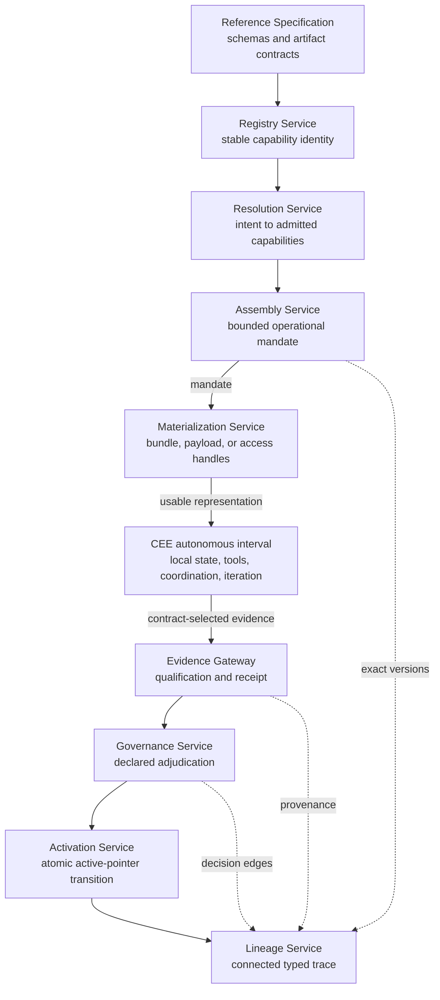

# Reference Implementation Architecture

This document maps the concepts and responsibilities described by
**Institutional Capability Lineages (ICLA)** directly to the executable code in
this reference implementation.

The paper defines the architecture. The sibling `../specification/` directory
defines the artifact contracts. This package demonstrates that those contracts
can be loaded, validated, connected, and transitioned without violating the
architectural invariants.

It is intentionally a deterministic, file-based demonstrator rather than an
enterprise platform. It requires no database, LLM, MCP server, cloud service,
or distributed infrastructure.

## Architectural flow



Materialization is a projection boundary: an assembly remains logically valid
independently of whether it is rendered as a YAML bundle, workspace, payload,
or governed access handles. The CEE box is an autonomous interval, not a
step-wise service loop. Registry interaction resumes only when the mandate
requires re-resolution or the CEE submits contract-selected evidence. Lineage
is shown at the end of the main flow, but it is populated throughout the
entire lifecycle.

## Direct mapping from the paper to the code

| Paper responsibility | Executable responsibility | Primary code |
|---|---|---|
| Reference Specification | Load the canonical schemas from `../specification/schemas`, resolve local `$ref` values, and validate artifacts | [`src/icla/specification/`](src/icla/specification/) |
| Organizational Memory | Preserve governed source authority while annotating overlapping semantic, procedural, and episodic roles on CKC bindings and assemblies | [`ckc.py`](src/icla/models/ckc.py), [`assembly.py`](src/icla/models/assembly.py) |
| Institutional Capability Registry | Preserve stable capability identity, relations, lifecycle, ownership, and active CKC pointers in immutable snapshots | [`registry.py`](src/icla/models/registry.py), [`registry_service.py`](src/icla/services/registry_service.py) |
| Capability Knowledge Contract (CKC) | Represent immutable, versioned knowledge scope, obligations, evidence, evaluation, governance, projection rules, and source bindings | [`ckc.py`](src/icla/models/ckc.py), [`ckc_repository.py`](src/icla/repositories/ckc_repository.py) |
| Operational Intent | Capture goal, context, consumer, risk, budget, assurance, and required outcomes | [`intent.py`](src/icla/models/intent.py) |
| Capability Resolution | Perform candidate generation, relation expansion, filtering, constraint validation, and admission | [`resolution_service.py`](src/icla/services/resolution_service.py) |
| Contextual Assembly | Bind exact versions and establish a bounded, execution-scoped mandate with explicit re-resolution triggers | [`assembly.py`](src/icla/models/assembly.py), [`assembly_service.py`](src/icla/services/assembly_service.py), [`mandate.py`](src/icla/policies/mandate.py) |
| Materialization | Deliver a bundle, payload, workspace, or governed access handles without changing assembly semantics or source authority | [`materialization_service.py`](src/icla/services/materialization_service.py) |
| Capability Execution Environment (CEE) | Operate autonomously inside the mandate, retain private working state, and return only contract-selected evidence | [`evidence.py`](src/icla/models/evidence.py), [`conformance.py`](src/icla/specification/conformance.py) |
| Execution Evidence | Separate governed from non-standard measurements, check schema and provenance, and issue a qualification receipt | [`evidence_gateway.py`](src/icla/services/evidence_gateway.py) |
| Governance | Persist an explicit institutional decision without synthesizing human approval | [`governance_service.py`](src/icla/services/governance_service.py) |
| Governed Activation | Verify an approved decision and atomically move the active CKC pointer while preserving history | [`activation_service.py`](src/icla/services/activation_service.py) |
| Institutional Capability Lineage | Build and validate the connected, typed trace across artifacts and transitions | [`lineage_service.py`](src/icla/services/lineage_service.py) |
| Impact Analysis | Identify capabilities, CKCs, retained assemblies, and consumers affected by a change | [`impact_analysis_service.py`](src/icla/services/impact_analysis_service.py) |
| Capability Crystallization | Detect declared recurrence and produce a proposal, never a capability directly | [`crystallization_service.py`](src/icla/services/crystallization_service.py) |

## Artifact flow

The reference flow transforms and appends artifacts; it does not mutate past
meaning:

```text
Operational Intent
    + immutable Registry Snapshot
    + active CKC pointers
        -> Resolution and Admission
        -> immutable Contextual Assembly
        -> Materialization or governed access handles
        -> autonomous CEE interval within the mandate
        -> contract-selected Execution Evidence Bundle
        -> Evidence Qualification Receipt
        -> declared Governance Decision
        -> separate Activation Record
        -> successor Registry Snapshot
        -> connected Institutional Capability Lineage
```

An assembly records the exact Registry snapshot and CKC versions used to build
it. Activating a successor CKC changes future resolution; it does not rewrite a
retained assembly or reinterpret historical evidence.

## Organizational memory roles

The implementation represents semantic, procedural, and episodic memory as
overlapping functional annotations on governed sources, not as physical stores
or mandatory CKC partitions:

- semantic roles cover concepts, policies, controls, and approved
  interpretations;
- procedural roles cover methods, workflows, tests, and executable guidance;
- episodic roles cover executions, decisions, incidents, exceptions, and
  evidence retained in lineage.

`source_bindings` declare the roles a source may play. `source_snapshot` and
`knowledge_role_composition` record which authorized elements entered an
assembly. The CEE consumes this governed memory and may produce new situated
knowledge during execution. Evidence preserves the producer and execution
identity and creates an episodic lineage record; adjudication may retain it as
a precedent, update a governed source binding, or authorize a successor CKC
that turns an accepted lesson into a semantic or procedural commitment.

## Service responsibilities

### Registry Service

The Registry Service is the navigation boundary over an immutable Registry
snapshot. It retrieves capabilities, filters them by institutional metadata,
traverses typed relations, and resolves active CKC pointers. Stable capability
identity remains separate from versioned capability knowledge.

### Resolution Service

Resolution turns an operational intent into a traceable admission result using
three explicit stages:

1. Candidate generation from required outcomes.
2. Graph expansion through Registry relations.
3. Constraint validation for lifecycle and authorization.

The output records admitted and excluded capabilities with rationale. Discovery
does not grant authority: only admitted capabilities may proceed to assembly.

### Assembly Service

Assembly combines the intent, resolution, immutable Registry snapshot, exact
CKC versions, policy references, source bindings, evaluation contracts, and
evidence contracts. It refuses to produce an assembly unless these conditions
hold:

- traceable;
- authorized;
- required outcomes covered;
- evaluation bound;
- conflicts resolved;
- within budget;
- exact CKC versions supplied.

The resulting assembly is authorized input to a CEE, not a claim that the
CEE's later observations or outputs are already institutional knowledge. It
also records the limits of delegated authority, permitted local autonomy,
evidence-disclosure boundary, and explicit re-resolution triggers.

### Materialization Service

Materialization makes the mandate usable without changing it. The reference
implementation supports YAML bundles, workspaces, and governed access handles.
Access handles retain source ownership and avoid copying payloads; their
descriptors and the logical assembly are hashed together for reproducibility.

Materialization does not initiate a step-wise control loop. The CEE may reuse
the admitted mandate until intent, coverage, authority, freshness, risk, or
assurance changes enough to require re-resolution.

### Evidence Gateway

The Evidence Gateway validates contract-selected CEE evidence and candidate knowledge
before governance review. It verifies schema conformity, governed metric
conformity, producer and execution provenance, and provenance completeness. It
keeps governed and non-standard measurements distinct and returns a receipt.
Qualification means *eligible for review*; it is not approval or institutional
admission. Internal reasoning, working memory, local stores, and intermediate
artifacts remain outside submission unless the evidence contract selects them.

### Governance and Activation

Governance records an explicit institutional decision. The implementation does
not use an LLM to imitate a reviewer and never infers approval from evidence.

Activation is intentionally a different service and operation:

```text
qualified evidence -> governance decision -> approved successor -> activation
```

An approved decision alone does not mutate the Registry. Activation verifies
the target capability, CKC identity, successor version, and decision status,
then returns a new Registry snapshot and a separate activation record.

### Lineage Service

Lineage connects intent, resolution, admission, assembly, materialization,
execution, evidence, governance, activation, and CKC succession through typed
edges such as:

- `derived_from`;
- `consumes`;
- `performed_by`;
- `operates_under`;
- `produced_during`;
- `submitted_as`;
- `adjudicates`;
- `authorized_by`;
- `supersedes`.

The service can validate that a capability trace is connected and can traverse
the graph from an execution or evidence identifier.

## Code layers

```text
src/icla/
├── models/          Specification-aligned information model
├── specification/   Schema loading, structural validation, conformance
├── policies/        Explicit and replaceable institutional rules
├── repositories/    Persistence boundaries without domain decisions
├── storage/         Local YAML, append-only records, immutable snapshots
├── services/        Architectural operations and transitions
├── api/             Technology-neutral ports and public facade
└── cli.py           Verification-oriented command-line interface
```

Dependencies point inward: the CLI and facade invoke services; services operate
on models and explicit policies; repositories hide storage. Storage mechanisms
do not decide authorization, admission, governance, or activation.

## Invariants demonstrated by the implementation

The conformance layer and tests make the main paper invariants executable:

| Invariant | Demonstrated property |
|---|---|
| ICLA-1 | Every active capability has stable identity, owner, lifecycle, and a governed active CKC pointer |
| ICLA-2 | Canonical CKCs declare immutable knowledge, operational relations, obligations, authorities, evidence, evaluation, source, and projection contracts |
| ICLA-3 | A bounded mandate preserves CEE autonomy and working-state privacy while candidate contributions retain identity and enter only through governed source or evidence paths |
| ICLA-4 | Registry entries are filterable by metadata, lifecycle, policy, and conditions and expose typed relations |
| ICLA-5 | Resolution and assembly retain intent, CEE, Registry, admission, and mandatory-constraint traceability |
| ICLA-6 | Assemblies pin CKC, evaluation-contract, source, policy, and transformation versions |
| ICLA-7 | A consumer projection cannot silently become a canonical CKC |
| ICLA-8 | Governed and non-standard measurements remain separate and receipts originate at the Evidence Gateway |
| ICLA-9 | Canonical change records impact, approval, exact pointer transition, and historical immutability |
| ICLA-10 | Retained assemblies include version and policy metadata needed for reproduction and interpretation |
| ICLA-11 | Only a governed, traceable promotion can assign a new institutional capability identity |

The corresponding tests live in [`tests/conformance/`](tests/conformance/).
The end-to-end [`oauth-042` test](tests/traces/test_oauth_042.py) loads the
published sibling artifacts, applies the Evolving profile to the complete
trace, generates the declared receipt, records adjudication, activates the
published successor CKC with the declared activation identifier, preserves the
historical assembly snapshot, and verifies connected lineage without creating
a new capability.

## Scope boundary

This implementation proves architectural behavior, not production deployment.
Authentication infrastructure, distributed transactions, databases, REST or
MCP transports, observability platforms, and human workflow systems remain
outside its scope. They may be added behind the existing ports without changing
the semantics of resolution, assembly, evidence, governance, activation, or
lineage.
