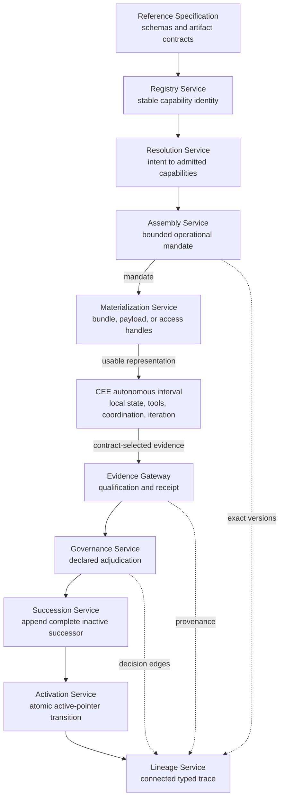

# Reference Implementation Architecture

This document maps the concepts and responsibilities described by
**Institutional Capability Lineage Architecture (ICLA)** directly to the executable code in
this reference implementation.

The paper defines the architecture. The sibling `../specification/` directory
defines the artifact contracts. This package demonstrates that those contracts
can be loaded, validated, connected, and transitioned without violating the
architectural invariants.

It is intentionally a deterministic, file-based demonstrator rather than an
enterprise platform. It requires no database, LLM, MCP server, cloud service,
or distributed infrastructure.

## Architectural flow


```mermaid
flowchart TD
    SPEC["Reference Specification<br/>schemas and artifact contracts"]
    REG["Registry Service<br/>stable capability identity"]
    RES["Resolution Service<br/>intent to admitted capabilities"]
    ASM["Assembly Service<br/>bounded operational mandate"]
    MAT["Materialization Service<br/>bundle, payload, or access handles"]
    CEE["CEE autonomous interval<br/>local state, tools, coordination, iteration"]
    EVD["Evidence Gateway<br/>qualification and receipt"]
    GOV["Governance Service<br/>declared adjudication"]
    SUC["Succession Service<br/>append complete inactive successor"]
    ACT["Activation Service<br/>atomic active-pointer transition"]
    LIN["Lineage Service<br/>connected typed trace"]

    SPEC --> REG
    REG --> RES
    RES --> ASM
    ASM -->|"mandate"| MAT
    MAT -->|"usable representation"| CEE
    CEE -->|"contract-selected evidence"| EVD
    EVD --> GOV
    GOV --> SUC
    SUC --> ACT
    ACT --> LIN

    ASM -. "exact versions" .-> LIN
    EVD -. "provenance" .-> LIN
    GOV -. "decision edges" .-> LIN
```

Materialization is a projection boundary: an assembly remains logically valid
independently of whether it is rendered as a YAML bundle, workspace, payload,
or governed access handles. The CEE box is an autonomous interval, not a
step-wise service loop. Registry interaction resumes only when the mandate
requires re-resolution or the CEE submits contract-selected evidence. Lineage
is shown at the end of the main flow, but it is populated throughout the
entire lifecycle.

## Direct mapping from the paper to the code

This mapping is a traceability view over the iteratively refined artifact. It
shows where declared architectural responsibilities become inspectable and
executable; it does not claim that the implementation was mechanically or
linearly derived from the literature.

| Paper responsibility | Executable responsibility | Primary code |
|---|---|---|
| Reference Specification | Load the canonical schemas from `../specification/schemas`, resolve local `$ref` values, and validate artifacts | [`src/icla/specification/`](src/icla/specification/) |
| Organizational Memory | Preserve governed source authority while annotating overlapping semantic, procedural, and episodic roles on CKC bindings and assemblies | [`ckc.py`](src/icla/models/ckc.py), [`assembly.py`](src/icla/models/assembly.py) |
| Institutional Capability Registry | Preserve stable capability identity, relations, lifecycle, ownership, and active CKC pointers in immutable snapshots | [`registry.py`](src/icla/models/registry.py), [`registry_service.py`](src/icla/services/registry_service.py) |
| Capability Knowledge Contract (CKC) | Represent immutable, versioned knowledge scope, obligations, evidence, evaluation, governance, projection rules, and source bindings | [`ckc.py`](src/icla/models/ckc.py), [`ckc_repository.py`](src/icla/repositories/ckc_repository.py) |
| Operational Intent | Capture goal, context, consumer, risk, budget, assurance, and required outcomes | [`intent.py`](src/icla/models/intent.py) |
| Capability Resolution | Perform candidate generation, relation expansion, filtering, constraint validation, and admission | [`resolution_service.py`](src/icla/services/resolution_service.py) |
| Contextual Assembly | Bind exact versions and establish a bounded, execution-scoped mandate with explicit re-resolution triggers | [`assembly.py`](src/icla/models/assembly.py), [`assembly_service.py`](src/icla/services/assembly_service.py), [`mandate.py`](src/icla/policies/mandate.py) |
| Materialization | Deliver a bundle, payload, workspace, or governed access handles without changing assembly semantics or source authority | [`materialization_service.py`](src/icla/services/materialization_service.py) |
| Capability Execution Environment (CEE) | Record an execution-scoped situated boundary and the configuration needed for resolution, authorization, assurance, traceability, and evidence interpretation; operate autonomously inside the mandate and return only contract-selected evidence | [`intent.py`](src/icla/models/intent.py), [`evidence.py`](src/icla/models/evidence.py), [`conformance.py`](src/icla/specification/conformance.py) |
| Execution Evidence | Separate governed from non-standard measurements, check schema and provenance, and issue a qualification receipt | [`evidence_gateway.py`](src/icla/services/evidence_gateway.py) |
| Governance | Persist an explicit institutional decision without synthesizing human approval | [`governance_service.py`](src/icla/services/governance_service.py) |
| CKC Succession | Verify the decision-linked delta and append the complete successor as an inactive lineage version without moving the Registry pointer | [`succession_service.py`](src/icla/services/succession_service.py), [`ckc_repository.py`](src/icla/repositories/ckc_repository.py) |
| Governed Activation | Verify an approved decision, atomically move the active CKC pointer, and support an exact pre-authorized rollback while preserving history | [`activation_service.py`](src/icla/services/activation_service.py) |
| Lineage trace | Build and validate a concrete connected, typed instantiation of the institutional capability lineage across artifacts and transitions | [`lineage_service.py`](src/icla/services/lineage_service.py) |
| Impact Analysis | Identify source bindings, exact CKC versions, relation paths, retained assemblies, situated CEEs, and consumers affected by individual changes or ordered change-event streams | [`impact_analysis_service.py`](src/icla/services/impact_analysis_service.py) |
| Capability Crystallization | Represent the governed proposal boundary without executing promotion; new Registry identity, initial CKC creation, and promotion-origin links remain prospective | [`conformance.py`](src/icla/specification/conformance.py), [`governance-decision.yaml`](../specification/reference-traces/oauth-042/governance-decision.yaml) |

## Artifact flow

The reference flow transforms and appends artifacts; it does not mutate past
meaning:

```text
Operational Intent
    + immutable Registry Snapshot
    + active CKC pointers
        -> Resolution and Admission
        -> immutable Contextual Assembly
        -> Materialization or governed access handles
        -> autonomous CEE interval within the mandate
        -> contract-selected Execution Evidence Bundle
        -> Evidence Qualification Receipt
        -> declared Governance Decision
        -> inactive Successor Append Receipt
        -> separate Activation Record
        -> successor Registry Snapshot
        -> connected lineage trace
```

An assembly records the exact Registry snapshot and CKC versions used to build
it. Activating a successor CKC changes future resolution; it does not rewrite a
retained assembly or reinterpret historical evidence.

The worked example begins with the same rule applied before OAuth resolution:
`CHG-IDENTITY-POLICY-008` reaches `CAP-IAM` through its governed source
binding, traverses the declared Registry relation neighborhood, and produces
`IMP-IAM-008`. Governance authorizes `DELTA-IAM-007-008` in `DEC-IAM-008`,
`APPEND-IAM-008` adds the complete `CKC-IAM v8` without changing the pointer,
and `ACT-IAM-008` makes that appended version current only for later resolutions.
`ASM-IAM-HIST-007` remains pinned to v7. The nested history lives in
`capability-registry.yaml`; no additional principal object or schema is needed
for this reference fixture.

## Organizational memory roles

The implementation represents semantic, procedural, and episodic memory as
overlapping functional annotations on governed sources, not as physical stores
or mandatory CKC partitions:

- semantic roles cover concepts, policies, controls, and approved
  interpretations;
- procedural roles cover methods, workflows, tests, and executable guidance;
- episodic roles cover executions, decisions, incidents, exceptions, and
  evidence retained in lineage.

`source_bindings` declare the roles a source may play. `source_snapshot` and
`knowledge_role_composition` record which authorized elements entered an
assembly. The CEE consumes this governed memory and may produce new situated
knowledge during execution. Evidence preserves the producer and execution
identity and creates an episodic lineage record; adjudication may retain it as
a precedent, update a governed source binding, or authorize a successor CKC
that turns an accepted lesson into a semantic or procedural commitment.

## Service responsibilities

### Registry Service

The Registry Service is the navigation boundary over an immutable Registry
snapshot. It retrieves capabilities, filters them by institutional metadata,
traverses typed relations, and resolves active CKC pointers. Stable capability
identity remains separate from versioned capability knowledge.

### Resolution Service

Resolution turns an operational intent into a traceable admission result using
three explicit stages:

1. Candidate generation from required outcomes.
2. Graph expansion through Registry relations.
3. Constraint validation for lifecycle and authorization.

The output records admitted and excluded capabilities with rationale. Discovery
does not grant authority: only admitted capabilities may proceed to assembly.

### Assembly Service

Assembly combines the intent, resolution, immutable Registry snapshot, exact
CKC versions, policy references, source bindings, evaluation contracts, and
evidence contracts. It refuses to produce an assembly unless these conditions
hold:

- traceable;
- authorized;
- required outcomes covered;
- evaluation bound;
- conflicts resolved;
- within budget;
- exact CKC versions supplied.

The resulting assembly is authorized input to a CEE, not a claim that the
CEE's later observations or outputs are already institutional knowledge. It
also records the limits of delegated authority, permitted local autonomy,
evidence-disclosure boundary, and explicit re-resolution triggers.

### Materialization Service

Materialization makes the mandate usable without changing it. The reference
implementation supports YAML bundles, workspaces, and governed access handles.
Access handles retain source ownership and avoid copying payloads; their
descriptors and the logical assembly are hashed together for reproducibility.

Materialization does not initiate a step-wise control loop. The CEE may reuse
the admitted mandate until intent, coverage, authority, freshness, risk, or
assurance changes enough to require re-resolution.

### Evidence Gateway

The Evidence Gateway validates contract-selected CEE evidence and candidate knowledge
before governance review. It verifies schema conformity, governed metric
conformity, producer and execution provenance, and provenance completeness. It
keeps governed and non-standard measurements distinct and returns a receipt.
Qualification means *eligible for review*; it is not approval or institutional
admission. Internal reasoning, working memory, local stores, and intermediate
artifacts remain outside submission unless the evidence contract selects them.

### Governance, Succession Append, and Activation

Governance records an explicit institutional decision. The implementation does
not use an LLM to imitate a reviewer and never infers approval from evidence.

Successor append and activation are intentionally different services and
operations:

```text
qualified evidence -> governance decision -> complete successor append (inactive) -> activation
```

An approved decision alone does not mutate the Registry. The Succession Service
verifies the target capability, exact predecessor, decision status, and delta
recording changed CKC commitments, supporting evidence, rationale, authorizing
decision, and rollback. It appends the complete immutable successor—not a
reconstruction patch—and emits an inactive-successor receipt while leaving the
active pointer unchanged. Activation accepts only that previously appended
successor, verifies the exact append reference and pointer transition, then
returns a new Registry snapshot and a separate activation record.

### Lineage Service

Lineage connects intent, resolution, admission, assembly, materialization,
execution, evidence, governance, activation, and CKC succession through typed
edges such as:

- `derived_from`;
- `consumes`;
- `performed_by`;
- `operates_under`;
- `produced_during`;
- `submitted_as`;
- `adjudicates`;
- `authorized_by`;
- `supersedes`.

The service can validate that a capability trace is connected and can traverse
the graph from an execution or evidence identifier.

## Code layers

```text
src/icla/
├── models/          Specification-aligned information model
├── specification/   Schema loading, structural validation, conformance
├── policies/        Explicit and replaceable institutional rules
├── repositories/    Persistence boundaries without domain decisions
├── storage/         Local YAML, append-only records, immutable snapshots
├── services/        Architectural operations and transitions
├── api/             Technology-neutral ports and public facade
└── cli.py           Verification-oriented command-line interface
```

Dependencies point inward: the CLI and facade invoke services; services operate
on models and explicit policies; repositories hide storage. Storage mechanisms
do not decide authorization, admission, governance, or activation.

## Invariants demonstrated by the implementation

The conformance layer and tests make the main paper invariants executable:

| Invariant | Demonstrated property |
|---|---|
| ICLA-1 | Every active capability has stable identity, owner, lifecycle, and a governed active CKC pointer |
| ICLA-2 | Canonical CKCs declare immutable knowledge, operational relations, obligations, authorities, evidence, evaluation, source, and projection contracts |
| ICLA-3 | Every execution records its situated CEE boundary and relevant configuration; autonomy and working-state privacy remain bounded, and candidate contributions gain authority only through governed adjudication |
| ICLA-4 | Registry entries are filterable by metadata, lifecycle, policy, and conditions and expose typed relations |
| ICLA-5 | Resolution and assembly retain intent, situated CEE boundary and configuration, Registry, admission, and mandatory-constraint traceability |
| ICLA-6 | Assemblies pin CKC, evaluation-contract, source, policy, and transformation versions |
| ICLA-7 | A consumer projection cannot silently become a canonical CKC |
| ICLA-8 | Governed and non-standard measurements remain separate and receipts originate at the Evidence Gateway |
| ICLA-9 | Canonical change records impact, approval, a complete immutable successor CKC, its decision-linked delta, inactive append, exact later pointer transition, rollback target, and historical immutability |
| ICLA-10 | Retained assemblies include version and policy metadata needed for reproduction and interpretation |
| ICLA-11 | Only governed, traceable promotion may assign a new identity; the current companion represents this boundary but does not execute promotion |

The corresponding tests live in [`tests/conformance/`](tests/conformance/).
The end-to-end [`oauth-042` test](tests/traces/test_oauth_042.py) loads the
published sibling artifacts, applies Evolving checks to the represented
resolution-to-succession scope, verifies event-linked impact analysis and the
unpromoted proposal boundary,
generates the declared evidence receipt, records adjudication, appends the
published successor CKC without activating it, then performs the separately
authorized activation with its exact rollback target, preserves the historical
assembly snapshot, and verifies connected lineage without creating a new
capability.

## Scope boundary

This implementation demonstrates executable consistency with the declared
architectural behavior; it does not prove organizational effectiveness or
production readiness.
The linked OAuth trace is a constructed demonstration. Schema validation,
deterministic replay, negative cases, and invariant checks provide artificial
technical evaluation within the stated resolution-to-succession scope.
Comparative longitudinal evaluation is prospective, and independent
organizational validation remains future work.
Authentication infrastructure, distributed transactions, databases, REST or
MCP transports, observability platforms, and human workflow systems remain
outside its scope. They may be added behind the existing ports without changing
the semantics of resolution, assembly, evidence, governance, activation, or
lineage.
