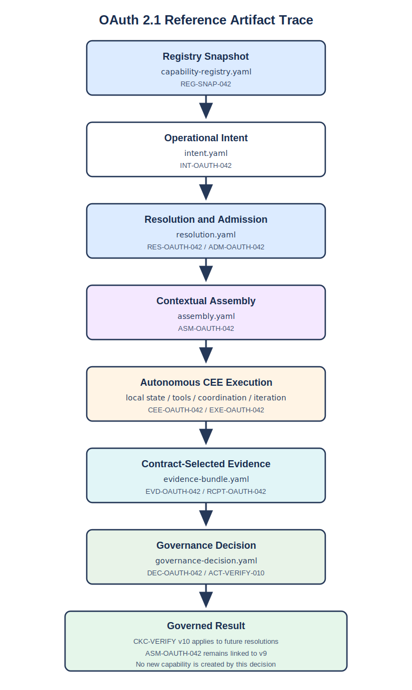

# OAuth 2.1 Reference Artifact Trace

This directory serializes the `OAUTH-042` worked example from *Institutional
Capability Lineages*. Each file represents one governed object in the
execution trace and links to the identifiers produced by the preceding step.

These artifacts target `icla-spec: 0.1.0` and validate against the draft
schemas in [`schemas/`](../../schemas/README.md). Both the instances and the
schemas remain non-normative at this stage.



## Object Graph

```text
REG-SNAP-042
      │
      ▼
INT-OAUTH-042
      │
      ▼
RES-OAUTH-042 / ADM-OAUTH-042
      │
      ▼
ASM-OAUTH-042
      │
      ▼
EVD-OAUTH-042 / RCPT-OAUTH-042
      │
      ▼
DEC-OAUTH-042 / ACT-VERIFY-010
      │
      ▼
CKC-VERIFY v10 (future resolutions)
```

## Trace

1. [Registry Snapshot](./capability-registry.yaml) — `REG-SNAP-042` records
   capability identities, relations, owners, and active CKC pointers.
2. [Intent](./intent.yaml) — `INT-OAUTH-042` declares the OAuth 2.1 goal,
   consumer, risk, budget, constraints, and required assurance.
3. [Resolution](./resolution.yaml) — `RES-OAUTH-042` navigates the Registry,
   expands mandatory relations, excludes inapplicable capabilities, resolves
   the compatibility conflict, and produces admission `ADM-OAUTH-042`.
4. [Assembly](./assembly.yaml) — `ASM-OAUTH-042` snapshots six exact CKC
   versions, selects and excludes knowledge, binds governed metrics, and
   defines the agent and reviewer materializations. `CEE-OAUTH-042` consumes
   the authorized semantic, procedural, and episodic elements selected into
   that assembly.
5. [Evidence Bundle](./evidence-bundle.yaml) — `EVD-OAUTH-042` returns
   situated knowledge produced by `CEE-OAUTH-042` during `EXE-OAUTH-042` as
   artifacts, provenance, five conforming governed measurements, and one
   explicitly non-standard measurement. The serialized object shows the
   post-Gateway state; the executable test removes the receipt from the
   submission and verifies that the Gateway recreates `RCPT-OAUTH-042`. It also
   records the execution as episodic memory, preserves candidate producer and
   execution identity, and declares candidate memory-role transitions.
6. [Governance Decision](./governance-decision.yaml) — `DEC-OAUTH-042`
   accepts the conforming evidence, retains a local exception, creates
   successor `CKC-VERIFY v10`, and activates it through `ACT-VERIFY-010` only
   for future resolutions.
7. [Successor CKC](./ckc-verify-v10.yaml) — the complete immutable
   `CKC-VERIFY v10` contract records its predecessor, scope, obligations,
   authorities, evidence and evaluation definitions, source bindings,
   projection rules, and governing decision.

The trace treats semantic, procedural, and episodic as overlapping functional
roles. `DEC-OAUTH-042` retains the service-local exception as an episodic
precedent and admits the reusable compatibility-test pattern as a procedural
commitment in `CKC-VERIFY v10`.

## Result

- `ASM-OAUTH-042` remains immutably linked to `CKC-VERIFY v9`.
- Future resolutions use `CKC-VERIFY v10` after activation.
- No new institutional capability is created by this decision.
- Later recurrent executions may support `PROP-AUTH-EVOL-01`, which requires a
  separate institutional review before any capability promotion.

The trace therefore demonstrates both evolution paths described in the paper:
successor evolution within an existing capability and separately governed
capability crystallization.
