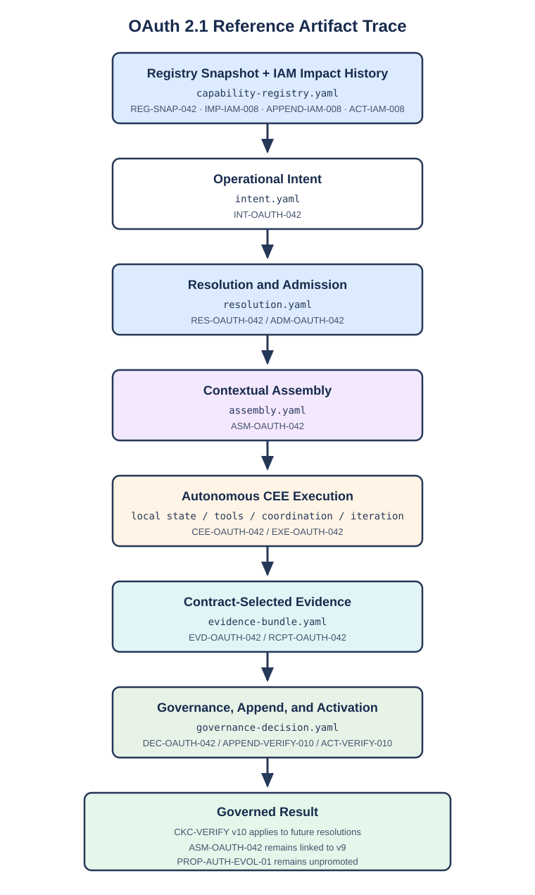

# OAuth 2.1 Reference Artifact Trace

This directory serializes the `OAUTH-042` worked example from *Institutional
Capability Lineage Architecture*. Each file represents one governed object in
the execution trace and links to the identifiers produced by the preceding
step.

These artifacts target `icla-spec: 0.1.0` and validate against the draft
schemas in [`schemas/`](../../schemas/README.md). Both the instances and the
schemas remain non-normative at this stage.



## Pre-resolution IAM impact path

Before `INT-OAUTH-042`, identity-policy change
`CHG-IDENTITY-POLICY-008` revises the source's authorized interpretation and
temporal applicability. The Registry snapshot preserves the complete,
inspectable path without introducing another principal artifact type:

```text
CHG-IDENTITY-POLICY-008
        -> BIND-IDENTITY-POLICY
        -> IMP-IAM-008
        -> CAP-IAM + its Registry relation neighborhood
        -> DEC-IAM-008
        -> DELTA-IAM-007-008
        -> CKC-IAM v8 / APPEND-IAM-008 (inactive)
        -> ACT-IAM-008

ASM-IAM-HIST-007 remains linked to CKC-IAM v7
```

The impact record identifies the affected binding, exact CKC versions, six
relation-connected capabilities, and every traversed Registry edge. Only
`CAP-IAM` changes canonical state; the other capabilities are identified for
impact review and remain unchanged. Activation applies to future resolutions,
which is why `REG-SNAP-042` and `ASM-OAUTH-042` subsequently select
`CKC-IAM v8` while the retained historical assembly still points to v7.

## Object Graph

```text
REG-SNAP-042
      │
      ▼
INT-OAUTH-042
      │
      ▼
RES-OAUTH-042 / ADM-OAUTH-042
      │
      ▼
ASM-OAUTH-042
      │
      ▼
EVD-OAUTH-042 / RCPT-OAUTH-042
      │
      ▼
DEC-OAUTH-042 / APPEND-VERIFY-010 (inactive) / ACT-VERIFY-010
      │
      ▼
CKC-VERIFY v10 (future resolutions)
```

## Trace

1. [Registry Snapshot](./capability-registry.yaml) — `REG-SNAP-042` records
   capability identities, relations, owners, active CKC pointers, and the
   pre-resolution `CAP-IAM` impact and activation history described above.
2. [Intent](./intent.yaml) — `INT-OAUTH-042` declares the OAuth 2.1 goal,
   situated boundary `CEE-OAUTH-042`, configuration
   `CEE-CONFIG-OAUTH-042`, consumer, risk, budget, constraints, and required
   assurance.
3. [Resolution](./resolution.yaml) — `RES-OAUTH-042` navigates the Registry,
   expands mandatory relations, excludes inapplicable capabilities, resolves
   the compatibility conflict, retains matcher identity/version and explicitly
   non-calibrated qualitative confidence semantics, and produces the
   `admitted` outcome `ADM-OAUTH-042` with a nonempty exact active-CKC map.
4. [Assembly](./assembly.yaml) — `ASM-OAUTH-042` snapshots six exact CKC
   versions, selects and excludes knowledge, binds governed metrics, and
   records the deterministic `RequiredCovered` method and validator version
   plus the compatibility-conflict outcome and versioned policy basis before
   establishing the bounded operational mandate. Agent and reviewer
   CEE-side materializations preserve that mandate while `CEE-OAUTH-042`
   consumes the authorized semantic, procedural, and episodic elements selected
   into the assembly. Each MAT pins assembly and CEE, substrate/transformation
   versions, local policy-dependent representation, hash/access metadata, and
   evaluation/evidence bindings. Executable lineage exposes the bound source
   versions and both materialization records as nodes connected to the retained
   assembly.
5. [Evidence Bundle](./evidence-bundle.yaml) — `EVD-OAUTH-042` returns
   terminal, contract-selected knowledge produced by `CEE-OAUTH-042` during
   the autonomous `EXE-OAUTH-042` interval as artifacts, provenance, five
   conforming governed measurements, and one explicitly non-standard
   measurement. Local reasoning and working state are not submitted. The
   serialized object shows the
   post-Gateway state; the executable test removes the receipt from the
   submission and verifies that the Gateway recreates `RCPT-OAUTH-042`. It also
   retains the identifier and version of the transformation used to construct
   the submitted report, without treating such a transformation as mandatory
   for every evidence bundle. It
   records the execution as episodic memory, preserves candidate producer and
   execution identity, and declares submitted candidate lifecycle and
   memory-role transitions.
6. [Governance Decision](./governance-decision.yaml) — `DEC-OAUTH-042`
   accepts the conforming evidence, retains a local exception, authorizes the
   complete successor `CKC-VERIFY v10`, records its inactive append as
   `APPEND-VERIFY-010`, and activates that exact appended version through
   `ACT-VERIFY-010` only for future resolutions. The decision links its impact assessment to an
   identified change event, records `CKC-VERIFY v9` as the exact rollback
   target. It links complete successor `CKC-VERIFY v10` to
   `DELTA-VERIFY-009-010`, which records the changed CKC commitments,
   rationale, supporting evidence, authorizing decision, and rollback without
   acting as a reconstruction patch. It references, but does not embed or
   promote, `PROP-AUTH-EVOL-01`.
7. [Capability Proposal](./capability-proposal.yaml) — the independent
   pre-institutional candidate records current assembly and evidence signals,
   the finding that recurrence is not established, future execution types
   needed before submission, stable assembly rules, value basis, comparable
   outcomes, candidate ownership, overlap input, and proposal-scoped CKC draft.
8. [Successor CKC](./ckc-verify-v10.yaml) — the complete immutable
   `CKC-VERIFY v10` contract records its predecessor, scope, obligations,
   authorities, evidence and evaluation definitions, source bindings,
   projection rules, governing decision, and decision-linked successor delta.

The trace treats semantic, procedural, and episodic as overlapping functional
roles. `DEC-OAUTH-042` retains the service-local exception as an episodic
precedent and admits the reusable compatibility-test pattern as a procedural
commitment in `CKC-VERIFY v10`.

## Result

- The identity-policy change is traceable through `IMP-IAM-008` and
  `DEC-IAM-008` to `ACT-IAM-008`.
- `ASM-IAM-HIST-007` remains linked to `CKC-IAM v7`; the OAuth resolution uses
  the subsequently activated `CKC-IAM v8`.
- `ASM-OAUTH-042` remains immutably linked to `CKC-VERIFY v9`.
- `APPEND-VERIFY-010` adds `CKC-VERIFY v10` to the lineage without changing
  the active pointer.
- The executable negative path rejects a stale predecessor after v10 has been
  appended and preserves the single `[v9, v10]` canonical lineage.
- Future resolutions use `CKC-VERIFY v10` after activation.
- `CKC-VERIFY v9` remains eligible for later reactivation only through a new
  approved pointer decision; the original successor activation is not reused.
- No new institutional capability is created by this decision.
- The current OAuth trace does not by itself establish recurrence, so
  `PROP-AUTH-EVOL-01` remains a pre-institutional `candidate`; its proposed
  relations refer directionally to existing capabilities without assigning the
  future identity. Later recurrent executions may provide the evidence required
  under this history-driven review path. This is not a universal formation
  precondition: other proposals may be
  supported by unresolved intents, strategic decisions, process-analysis or
  onboarding records and a justified prospective continuity expectation. The OAuth
  trace does not assign
  `CAP-AUTH-EVOL`, create `CKC-AUTH-EVOL v1`, or validate promotion-origin
  links.

The trace executes successor evolution within an existing capability and
represents the separately governed crystallization boundary without promoting
its candidate. The independent
[`auth-evolution-formation`](../auth-evolution-formation/README.md) trace exercises
the later submitted-proposal formation path without changing the scientific
meaning of this single-execution example.
